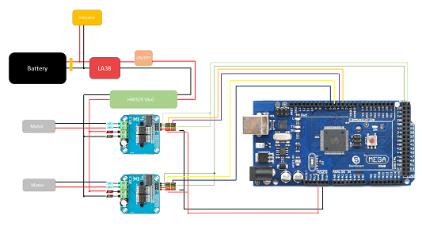
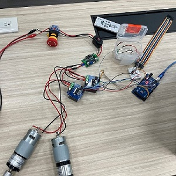
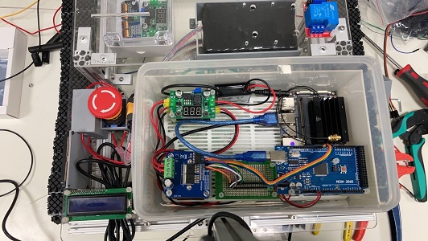
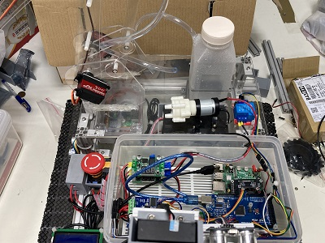

# Circuit Designs
`Electric components` 、 `circuit designs`  

__1. Computational Unit__  

* arduino mega -> `dc motor control` / arduino nano -> `servo motor`
* raspberry pi 4 (`wip`/`template`)
* nvidia jetson nano

__2.Electrical Unit__  

* IBT2 -> `H-Bridge`
* voltage converter `HW319-V6.0` / voltage indicator
* battery (`12v`) / battery pack (`5v/2a`) for computation unit
* emergency button `LA38`

__3.Sensors and Acuator__  

* step motor and servo motor
* relay `SRD-05VDC-SL-C` -> water pump

## Implements
###### tags:  `controller`、 `h-bridge`、 `regulator`、 `dc motor`

* Testing the driven part that connect the dc motor with h-bridge (`L298n`) and `12v` dc battery (here we test on power supplier first).
* Using the arduino mega as the controller for `PWN` signal output.
* check the general switch and emergency button work properly.

 

###### tags: `eletric boxes` 、 `water-proof`
* The voltage for each components are indicating strictly.
* The all important unit for controll and operation are places inside the water-proof container both for robotic cart and for the dummy arm.
* There are maly three type of voltage being managed. `12v` for DC motor driven; two `5v` one is for the main controller and other sensors, the other is for the servo motor on the robotic arm which is driven by the servo driver (`PCA9685`).

 

---
[`Components Lists`](./components_list.pdf)