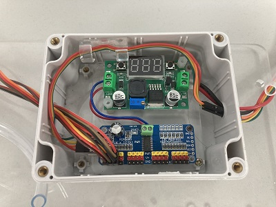

# Robotic Arm
`robotic arm` 、 `servo motor` 、 `gripper`

## Servo Motor
* `MG996R` for arm machenism / `SG90` for gripper.
* `PCA9685` servo driver for multi-servo PWM manager, control and driving.
* The import unit are stored inside the water-proof container.
*  [`motor driver | adafruit_PCA9685 pwm library`](http://adafruit.github.io/Adafruit-PWM-Servo-Driver-Library/html/class_adafruit___p_w_m_servo_driver.html#a3f400e2cc3df479ed98d0ce7e7a0860d)

 

**Implements**

The are two type of design we use in the first
* Using another controller (`Aduino Nano`) for edge controll and communicate with main controller in `I2C` protocal
* Using the main controller in the center direcly.

## Robotic Arm
`robotic arm design` 、 `inverse kinematic`

__Designs in CAD__

The prototype of dummy robotic arm.

__Outcomes__

* The arm is manufactor in `acrylic` material.
* Using the `483` bearing for connect each components with free degree ratation.
* The Spacer could also help fix the wire and water pip.

 

__Inverse Kinematic__

For more convinent to controll the robot arm to grip the specific object. We use the inverse kinematic to calculate that by giving the object position, and the cooresponding servo angle would be. Thus, we could using some object detection algorithms to get the coordinate of object, then using the `API` we build to controll the arm properly.

* `resetInit()` reset the robotic arm to the initialize status.
* `moveTo(int x, int y)` set the end side (griper side) to the cooresponding position coordinate in the space.

## Gripper
We design a simple gripper for the object gripping.

* `SG90` servo motor.
* Small camera for `depth` information update.
* check valve and pip for watering task.

 

**API**
* `grab()` set the gripper close to gripping the object.
* `ungrab()` release the gripper.