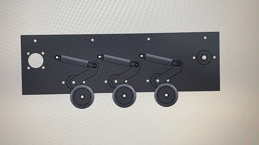
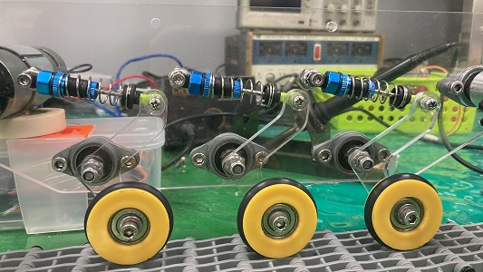

# Robotic Cart
`robotic cart` 、 `side panel` 

## Scroll wheel and Support Structures
Due to the robot is go through in the outdoor field environments, we hope to design `shock absorber` 、 `continuous track` scroll wheel.

__1. Designs in CAD__

* crank rocker mechanism.
* springs and bearings.

__2. Wheel Axles__

* lathing two axles for the back wheel.

  

__3. Outcomes__

* The track is driven by the `DC motor` in the front.
* Once encounter any strike, the spring and machanism would absorb the shock.

 